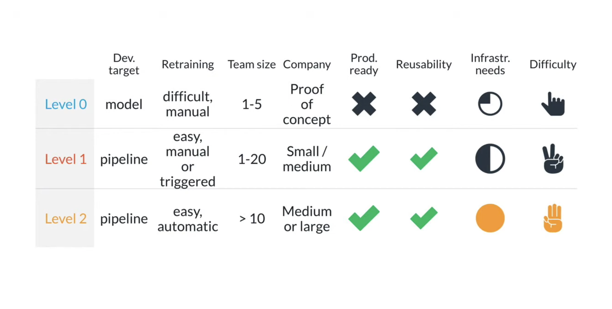
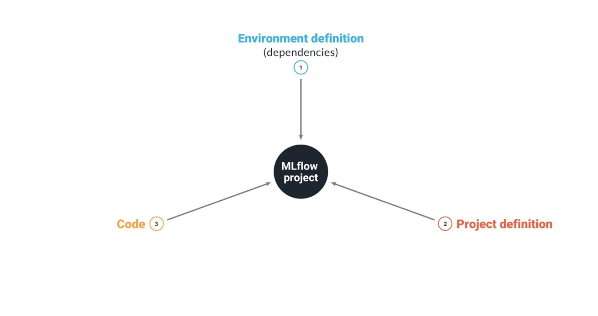
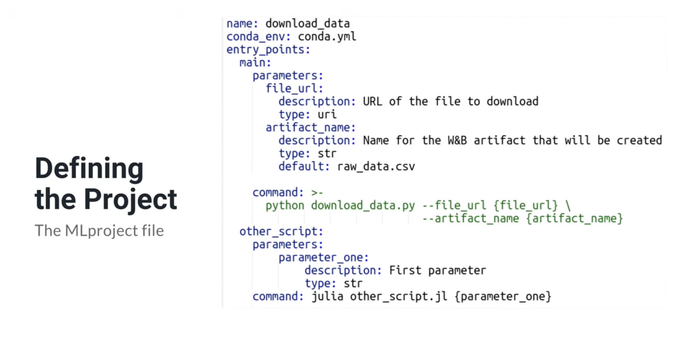
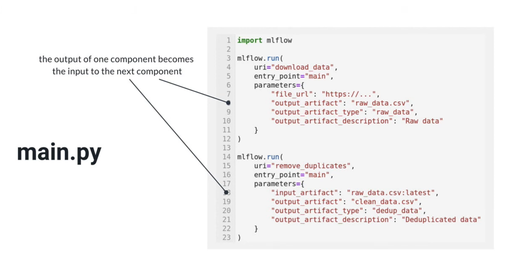
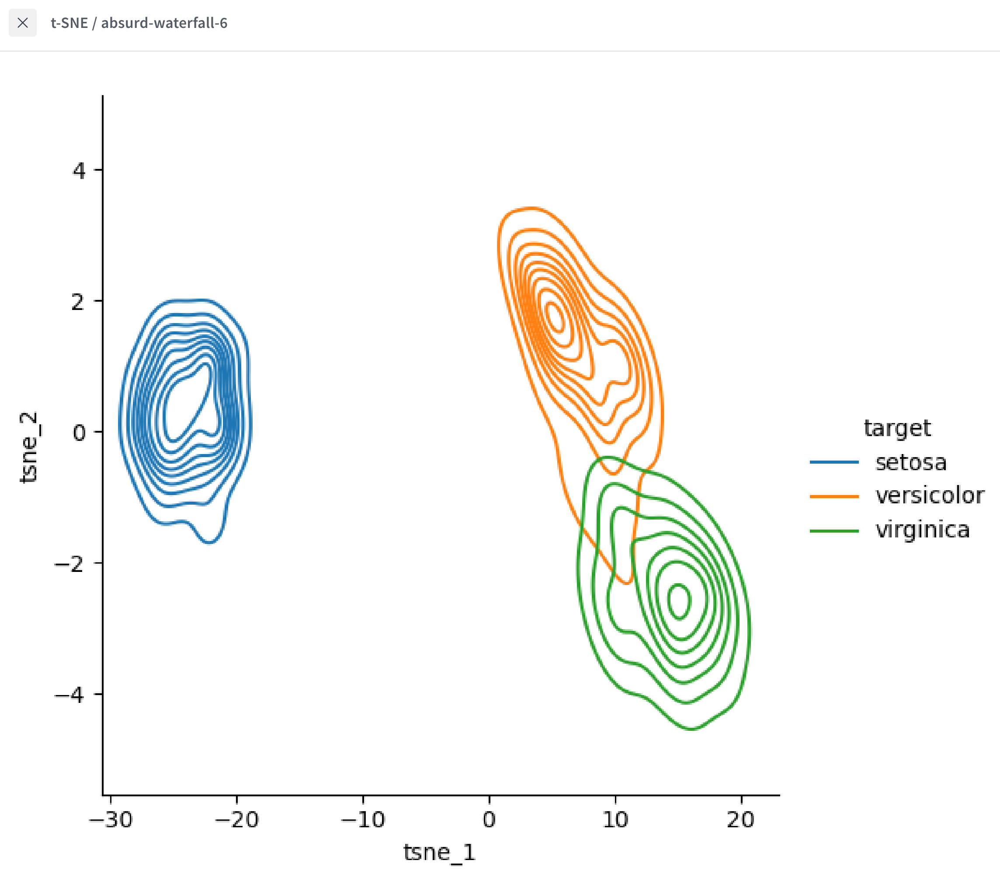
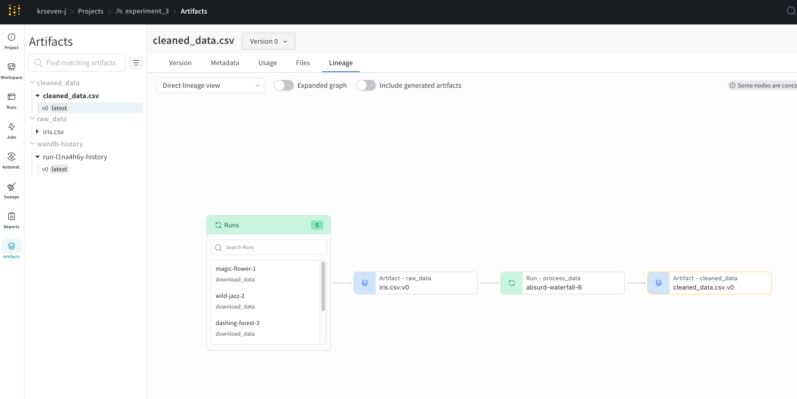
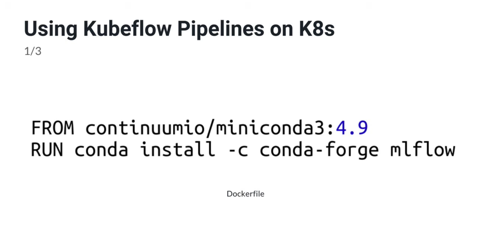
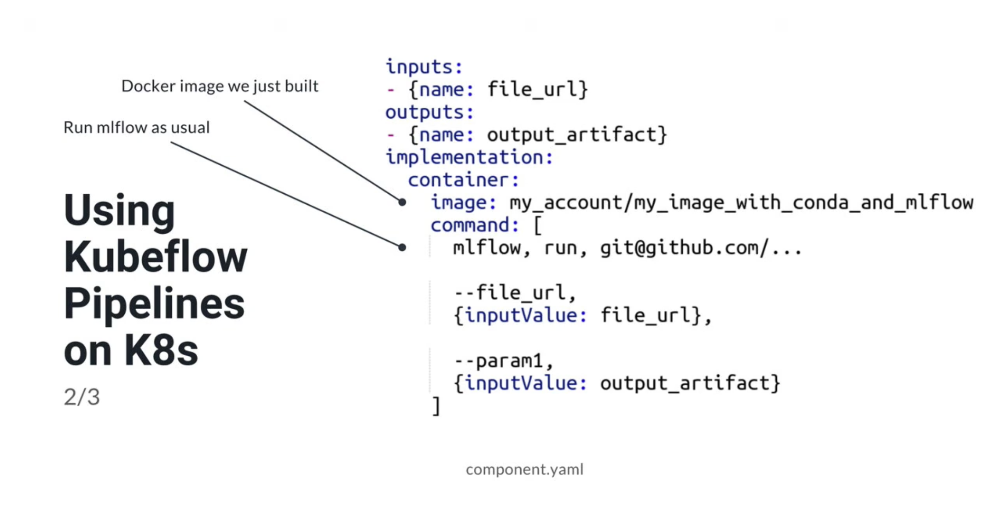

# Overview

# Using MLflow

# MLflow in Action

# MLflow real pipeline on wandb.ai (Lesson 1 Exercise 3)

- https://wandb.ai/krseven-j/experiment_3/workspace?nw=nwuserkrseven

- https://wandb.ai/krseven-j/experiment_3/artifacts/cleaned_data/cleaned_data.csv/v0/lineage

# MLflow with Kubernetes (KubeFlow)

