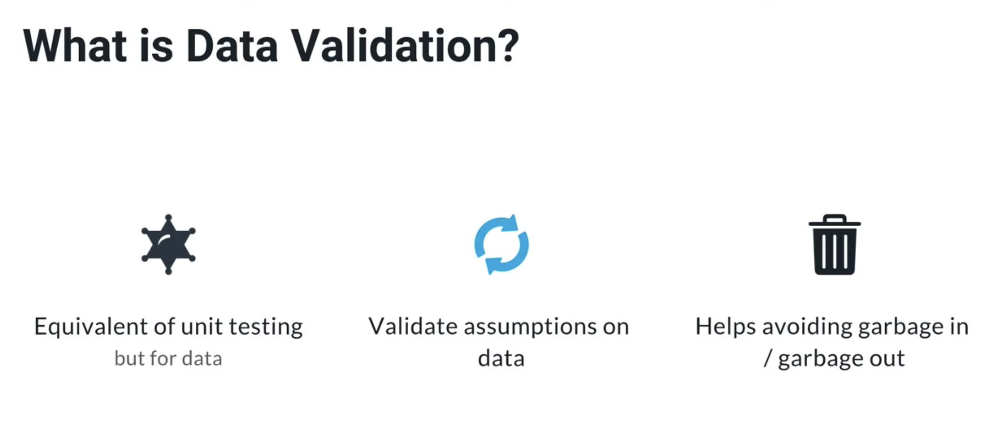
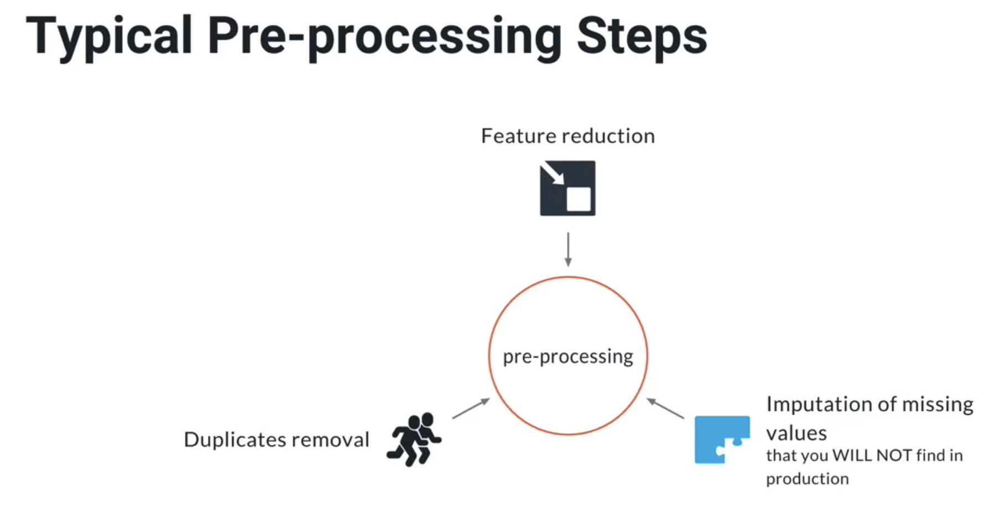
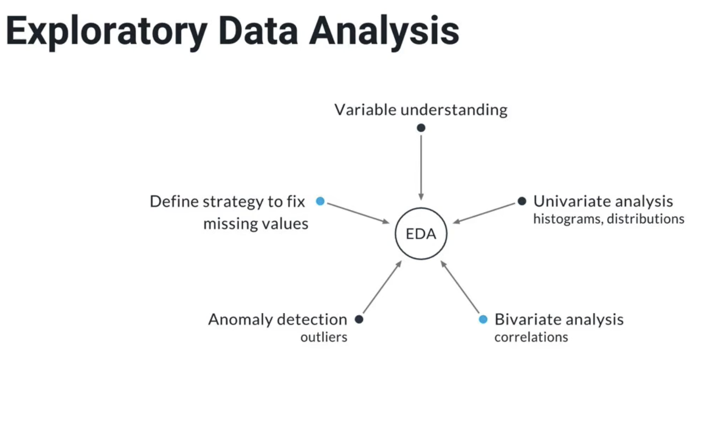
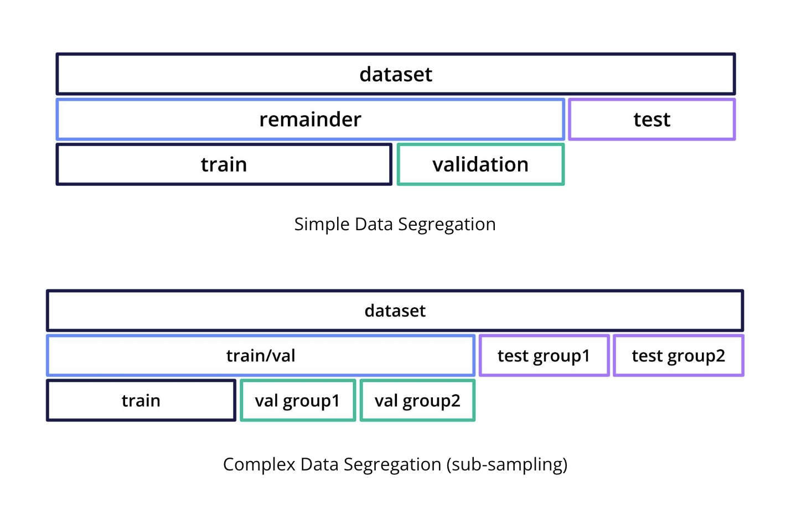
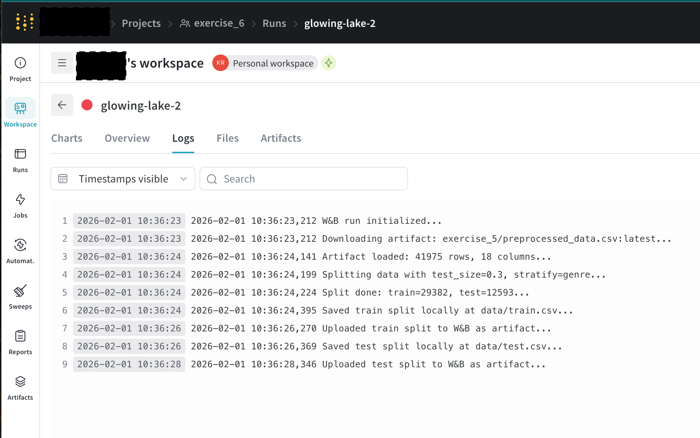
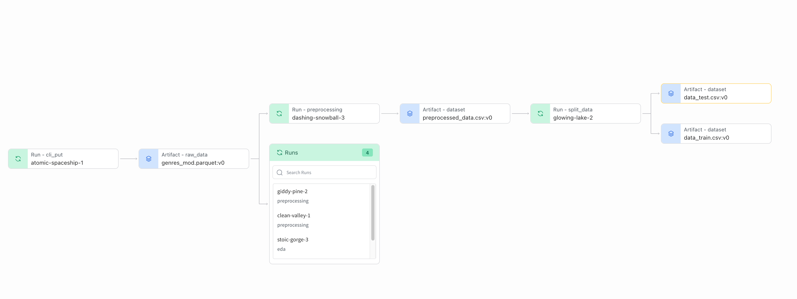
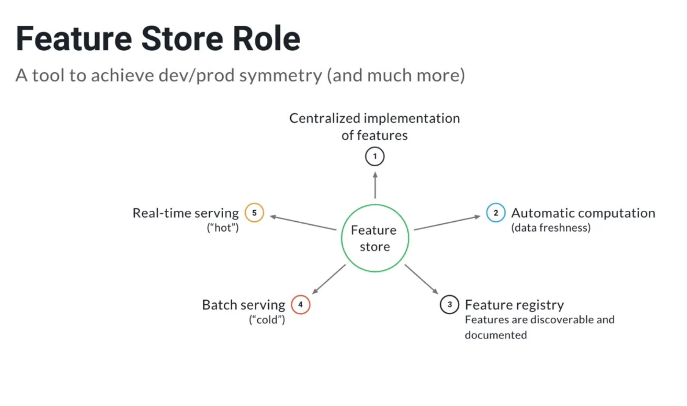
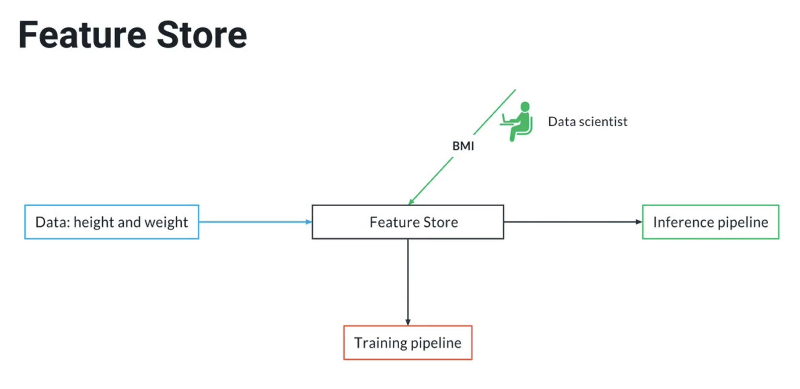

# Exercise 4–6: Data Preprocessing and Train/Test Split

## Overview

This series of exercises demonstrates a basic **ML workflow** using **MLflow** and **Weights & Biases (W&B)**, covering:

1. Data cleaning and feature creation
2. Artifact management with W&B
3. Splitting datasets for model development



---

## Exercise 4: Data Exploration & Preprocessing

**Goal:**
Prepare the raw songs dataset for machine learning.

**Steps:**

* Create an `MLproject` and `conda.yml` environment.
* Start a Jupyter notebook through MLflow:

  ```bash
  mlflow run .
  ```
* Load the raw dataset (`exercise_4/genres_mod.parquet`) from W&B:

  ```python
  artifact = run.use_artifact("exercise_4/genres_mod.parquet:latest")
  df = pd.read_parquet(artifact.file())
  ```
* Clean the dataset:

  * Drop duplicates:

    ```python
    df = df.drop_duplicates().reset_index(drop=True)
    ```
  * Fill missing values and create a new text feature:

    ```python
    df['title'].fillna('', inplace=True)
    df['song_name'].fillna('', inplace=True)
    df['text_feature'] = df['title'] + ' ' + df['song_name']
    ```
* Log the preprocessed data to W&B as `preprocessed_data.csv`.






---

## Exercise 5: Artifact Management

**Goal:**
Ensure reproducibility by saving cleaned data as a W&B artifact.

**Steps:**

* Save the cleaned dataset locally (CSV) and upload as a W&B artifact:

  ```python
  artifact = wandb.Artifact(
      name="preprocessed_data.csv",
      type="dataset",
      description="Cleaned genres_mod dataset with text_feature"
  )
  artifact.add_file("preprocessed_data.csv")
  run.log_artifact(artifact)
  ```
* Verify the artifact:

  ```bash
  wandb artifact get exercise_5/preprocessed_data.csv
  ```

---

## Exercise 6: Train/Test Split

**Goal:**
Split the preprocessed dataset into **train** and **test** sets for modeling.



**Steps:**

* Update `run.py` to accept MLflow parameters:

  * `input_artifact`
  * `artifact_root`
  * `artifact_type`
  * `test_size`
  * `stratify` (optional)
* Fetch the cleaned dataset from W&B:

  ```python
  artifact = run.use_artifact(args.input_artifact)
  df = pd.read_csv(artifact.file())
  ```
* Split the dataset using `scikit-learn`:

  ```python
  train_df, test_df = train_test_split(
      df,
      test_size=args.test_size,
      stratify=df[args.stratify] if args.stratify != 'null' else None,
      random_state=args.random_state
  )
  ```
* Save CSVs locally and upload as W&B artifacts:

  ```text
  data/train.csv
  data/test.csv
  ```
* Example MLflow command:

  ```bash
  mlflow run . \
    -P input_artifact="exercise_5/preprocessed_data.csv:latest" \
    -P artifact_root="data" \
    -P artifact_type="dataset" \
    -P test_size=0.3 \
    -P stratify="genre"
  ```

## wandb logs


## wandb graph



---

## Notes

* **MLflow** automatically creates a Conda environment from `conda.yml` to run scripts reproducibly.
* **W&B artifacts** ensure that datasets are versioned and can be reused in later exercises.
* **Text features** that are combinations of existing fields (like `text_feature`) can safely be computed at inference, but features that the model trains on should ideally be included during preprocessing.

---

## Workflow Diagram

```text
Raw Data (exercise_4/genres_mod.parquet)
          |
          v
Exercise 4: Preprocessing & text_feature creation
          |
          v
Artifact: preprocessed_data.csv (W&B)
          |
          v
Exercise 6: Train/Test Split
   /                     \
train.csv               test.csv
(local + W&B artifacts)
```

This diagram illustrates the flow from raw data → preprocessing → train/test split → W&B artifacts.

## Feature Store

A feature store is a centralized system for storing, managing, and serving features that are 
used for machine learning models. It ensures that features used during training are consistent 
with what is available at inference, and it helps avoid duplication or inconsistencies across 
projects and environments.

### Key Points:
- Central repository: Features are stored in a structured way for easy reuse.
- Consistency: Guarantees that the exact same computation used in training is available in production.
- Versioning: Each feature or dataset can have multiple versions, making experiments reproducible.
- Online vs offline:
    - Offline features: used during training (usually in batch)
    - Online features: served in real-time at inference

#### When is it created or updated?
**Created:**

Typically after preprocessing and feature engineering is finalized during training.
For example, once you compute text_feature = title + " " + song_name, this feature can be registered in the feature store.

**Updated:**

When new features are added or existing features are recomputed.
Can also be updated when new versions of the dataset arrive (e.g., daily updates for fresh data).

### Rule of thumb:

- Only store features that your model actually needs and that are computable consistently at inference.
- Features like text_feature in your exercise are perfect candidates because they are deterministic 
combinations of input columns, so they can be computed both in training and at inference.



