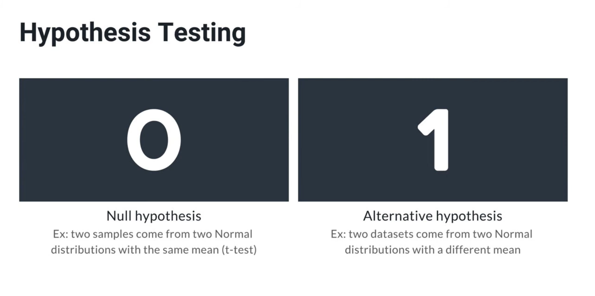
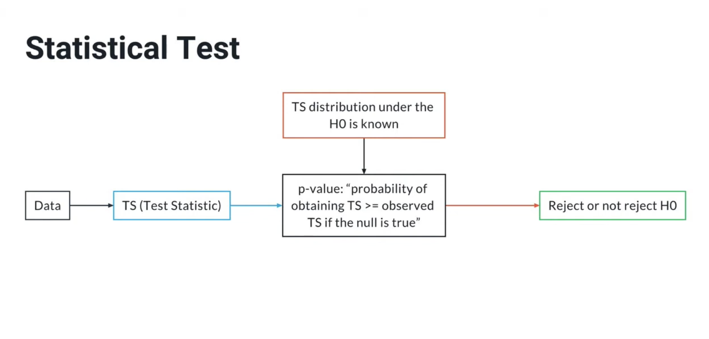

# Exercise 7–9: Data Validation

## Overview

1. Deterministic Testing
2. Non-Deterministic Testing
3. Using PyTest with parameters + other tools

### Deterministic Testing
A data test is deterministic if it produces the same result every time it is run on the same input, 
without relying on randomness or external factors.

#### Key Points:
- Reproducible ✅ — same input → same output
- Independent of timing, randomness, or environment
- Measures attributes that can be consistently verified, like column names, types, ranges, or allowed categories

### Non-Deterministic Testing
A data test is non-deterministic if it may produce different results across runs on the same input 
because it depends on randomness, sampling, time, or external state.

It probes for violation of an assumption about the data using **Statistical Hypothesis Testing**.

#### Key Points:
- Results can change between runs
- Often involve randomness, sampling, or time-based behavior
- Sensitive to data drift or distribution changes
- Used to detect trends or anomalies, not exact values
- Failures usually indicate suspicion, not certainty

### Examples:
### 1. Dataset Reference Testing
- It is common to compare the current dataset to a previous one and examine key attributes

### 2. Hypothesis Testing
- The Null Hypothesis is our assumption about the data, while the Alternative Hypothesis is a violation of that assumption.

### 2.1 T-Test Example
- In this case we consider the t-test. We consider the two samples, we compute the Test Statistic for the t-test, 
we compute the p-value and check if the p-value is larger or smaller than our pre-determined threshold (0.05).

If it is larger, we do not reject the null hypothesis which means that our test passes. 
If it is smaller, we reject the null hypothesis. 

This does not necessarily mean that there is something wrong with our dataset (because depending on the threshold we used, 
the test has a probability of false positives that is not zero), but we should look at it closely:

### NOTE: each statistical test comes with its own assumptions and hypothesis.
If these assumptions are violated, the statistical test becomes unreliable. 
Always verify what are the assumptions of the statistical test you are planning to use, 
and check whether they are justified in your specific case.

### NOTE: Repeating these tests thousands of times are bound to have a few false positives.
As datasets change over time, there are bound to be false positives that violate our test assumptions.
**However, it is better to have a few false positives from time to time, than to have a dataset that is drastically
different than what we expect.**

