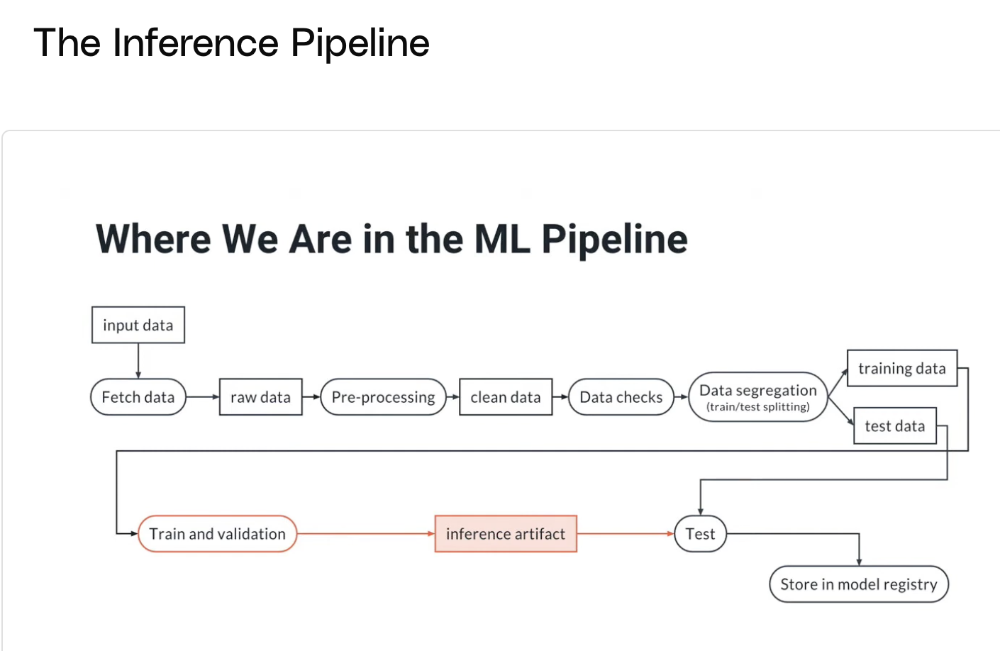
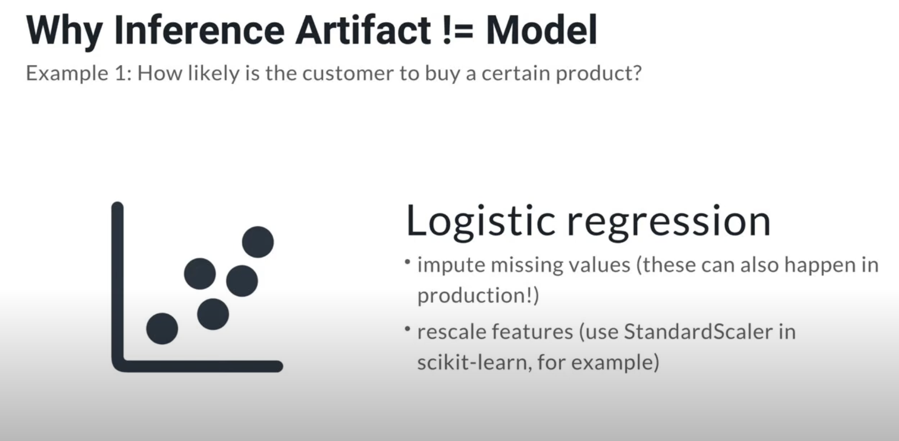
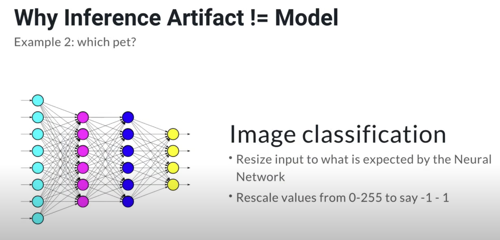
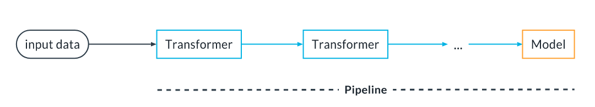
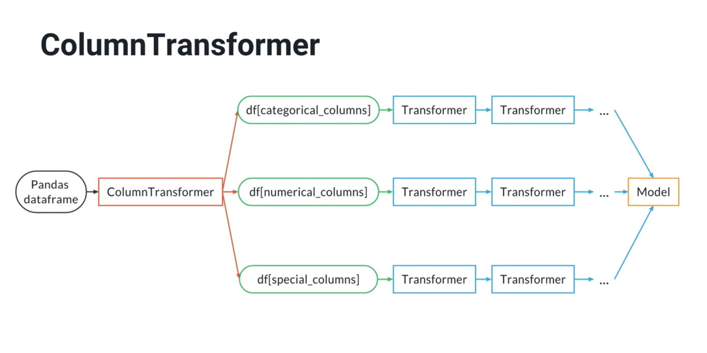
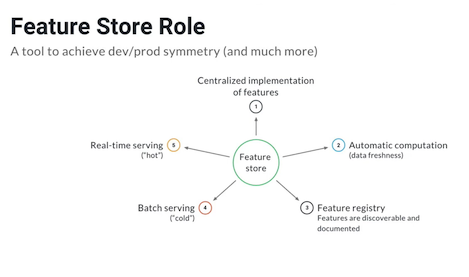
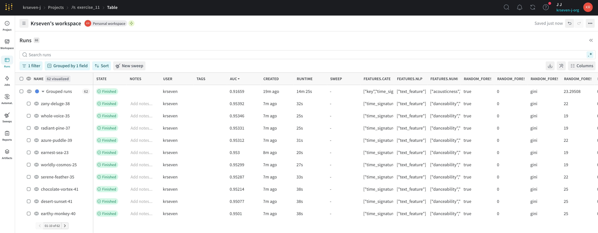

# Exercise 10-12: Training Validation + Experiment Tracking

## Overview

1. **Inference Pipelines**
2. **Experiment Tracking**
3. **Choosing the Best model**
4. **Validating and Exporting Your Model**

## 1. Inference Pipelines



### Why Inference Artifact != Model
- An **inference pipeline** is an ML pipeline that contains everything that needs to run in production at inference time: 
a pre-processing step that transforms the data input to the data expected by the model, and then the model.
- An **inference artifact** is a serialized (i.e., saved to disk) static version of the inference pipeline containing 
the preprocessing as well as a trained model.
- Examples:
  - 
  - 

## How this looks in real pipelines
- **What companies actually use**
  - **PyTorch**
    - Dominant for neural networks
    - **Used at Meta, OpenAI, Tesla, Uber, Netflix, Stripe, etc.**
    - First-class support for:
      - GPUs / distributed training
      - Custom architectures
      - Research → production workflows
    - De facto industry standard in 2025
    
  - **scikit-learn**
    - Not used for neural networks in production
    - Used for:
      - Linear / logistic regression
      - Random forests, GBMs
      - Clustering, PCA
      - Feature preprocessing
    - Its neural net module (MLPClassifier) is mostly educational / legacy

## Very common setup:
- **scikit-learn** → data prep, baselines, classical models
- **PyTorch** → deep learning models
- **XGBoost** / LightGBM → tabular production work
- ONNX / TorchScript / Triton → serving

- What about TensorFlow?
  - Still used (especially legacy systems)
  - Less common for new projects
  - **PyTorch** has won mindshare and hiring

## Bottom line

- Neural networks in production → **PyTorch**
- Classical ML in production → **scikit-learn** + **XGBoost**
- **scikit-learn** NN ≠ industry practice

## Development / Production Symmetry Principle
- If we are performing the same pre-processing at training time *and* inference time, it should be running the same code.
- **Feature Store** needs to be considered
- Most ML libraries allow you to save the **pre-processing steps** as well as the **trained model** into a **single artifact** that can be deployed.
  - **Scikit-learn Pipelines**
    - You can chain together preprocessing steps (transformers) and models into one object that can be exported.
    - 
    - ```python
       from sklearn.preprocessing import StandardScaler
       from sklearn.impute import SimpleImputer
       from sklearn.linear_model import LogisticRegression
       from sklearn.pipeline import Pipeline, make_pipeline
    
       pipe = Pipeline(
         steps=[
           ("imputer", SimpleImputer()),
           ("scaler", StandardScaler()),
           ("model", LogisticRegression())
         ]
       )
    
       # OR
       pipe = make_pipeline(SimpleImputer(), StandardScaler(), LogisticRegression())
    
       # fit the pipeline
       pipe.fit(X_train, y_train)
    
       # use for inference
       pipe.predict(X_test)
       pipe.predict_proba(X_test)
      ```
    
    - 
    - ```python
      import pandas as pd
      from sklearn.compose import ColumnTransformer
      from sklearn.feature_extraction.text import TfidfVectorizer
      from sklearn.preprocessing import StandardScaler, OneHotEncoder
      from sklearn.impute import SimpleImputer
      from sklearn.linear_model import LogisticRegression
      from sklearn.pipeline import make_pipeline
  
      # Example dataframe from the sklearn docs
      df = pd.DataFrame(
          {'city': ['London', 'London', 'Paris', 'Sallisaw'],
           'title': ["His Last Bow", "How Watson Learned the Trick",
                     "A Moveable Feast", "The Grapes of Wrath"],
           'expert_rating': [5, 3, 4, 5],
           'user_rating': [4, 5, 4, 3],
           'click': ['yes', 'no', 'no', 'yes']})
      y = df.pop("click")
      X = df
  
      # Build a Column transformer
      categorical_preproc = OneHotEncoder()
      text_preproc = TfidfVectorizer()
      numerical_preprocessing = make_pipeline(SimpleImputer(), StandardScaler())
      preproc = ColumnTransformer(
          transformers=[
              ("cat_transform", categorical_preproc, ['city']),
              ("text_transform", text_preproc, 'title'),
              ("num_transform", numerical_preprocessing, ['expert_rating', 'user_rating'])
          ],
          remainder='drop'
      )
      pipe = make_pipeline(preproc, LogisticRegression())
      pipe.fit(X, y)
      ```
  - **PyTorch Script**
    - The transformations needed by the neural network can be made part of the neural network by using "scriptable transforms" and exported with `torch.script`
    - ```python
         import torch
         from torchvision import transforms
         from torch.nn import Sequential, Softmax
         from PIL import Image
         import numpy as np

         # Get a pre-trained model
         model = torch.hub.load('pytorch/vision:v0.9.0', 'resnet18', pretrained=True)
         model.eval()

         # Define the inference pipeline
         pipe = Sequential(
             # NOTE: for the pipeline to be scriptable with script,
             # you must use a list [256, 256] instead of just one number (256)
             transforms.Resize([256, 256]),
             transforms.CenterCrop([224, 224]),
             transforms.Normalize(mean=[0.485, 0.456, 0.406], std=[0.229, 0.224, 0.225]),
             model,
             Softmax(1)
         )

         # Save inference artifact using torch.script
         scripted = torch.jit.script(pipe)
         scripted.save("inference_artifact.pt")

         # NOTE: normally we would upload it to the artifact store

         # Load inference artifact
         pipe_reload = torch.jit.load("inference_artifact.pt")

         # Load one example
         # NOTE: these operations are usually taken care by the inference
         # engine
         img = Image.open("dog.jpg")
         img.load()
         # Make into a batch of 1 element
         data = transforms.ToTensor()(np.asarray(img, dtype="uint8").copy()).unsqueeze(0)

         # Perform inference
         with torch.no_grad():
             logits = pipe_reload(data).detach()

         proba = logits[0]

         # Transform to class and print answer
         with open("imagenet_classes.txt", "r") as f:
             classes = [s.strip() for s in f.readlines()]
         print(f"Classification: {classes[proba.argmax()]}")
      ```
### Note: Sometimes the preprocessing stage includes some feature engineering. 
If the same feature engineering is shared across multiple models or is simply too computationally expensive 
to run in production, adopting a Feature Store would represent a good solution. 
See the earlier lesson on Data Exploration and Preparation for an introduction to the concept of Feature Stores.



