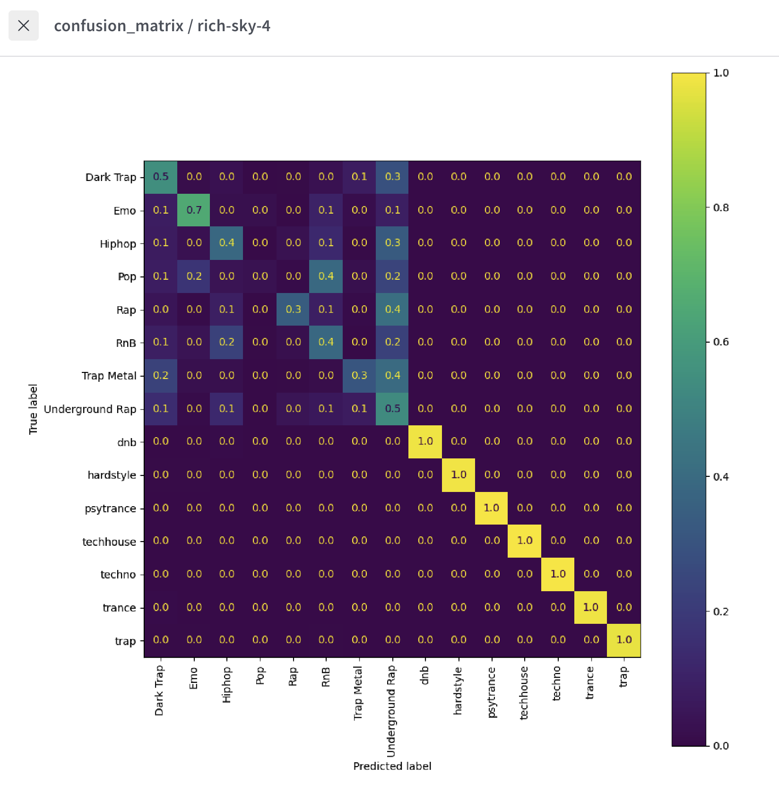
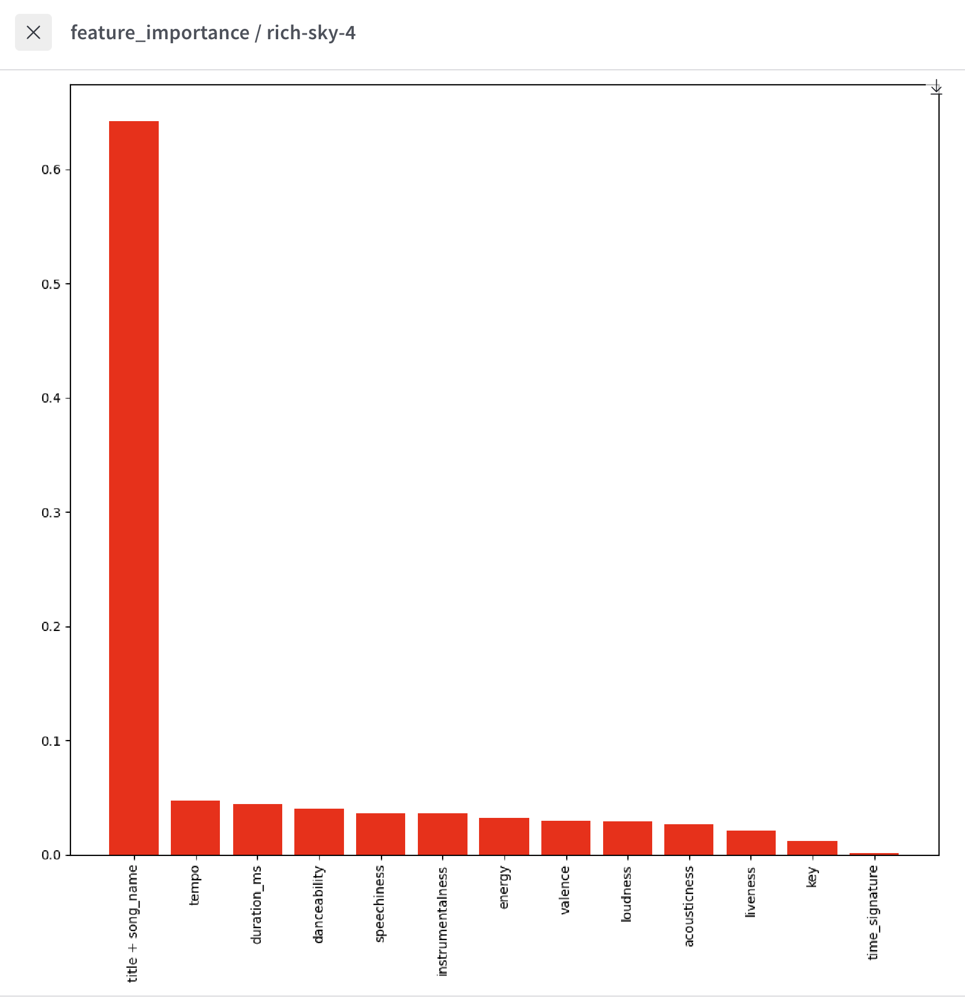

# Instructions
In this exercise we will write an inference pipeline.

The starter kit contains a main script that drives the pipeline (``main.py``) and a 
``random_forest`` component that you will complete.

You have to open the ``run.py`` script within the ``random_forest`` component, then go to the
function ``get_inference_pipeline`` and complete all the missing pieces (further 
instructions are in the file).

Once you are done, you can run your RandomForest with:

```bash
 conda create -n mlflow_tmp python=3.10
   conda activate mlflow_tmp
   pip3 install mlflow
```

Then:

```bash
mlflow run .
```

Make sure to checkout the ``config.yaml`` file to understand what dataset are being used, as well
as all the other default parameters.

wandb: Currently logged in as: krseven (krseven-j) to https://api.wandb.ai. Use `wandb login --relogin` to force relogin
wandb: Tracking run with wandb version 0.21.3
wandb: Run data is saved locally in /Users/j/Desktop/nd0821-c2-build-model-workflow-exercises/lesson-4-training-validation-experiment-tracking/exercises/exercise_10/starter/random_forest/wandb/run-20260210_191330-0e1irlem                                                                                                                                                                   
wandb: Run `wandb offline` to turn off syncing.
wandb: Syncing run rich-sky-4
wandb: ⭐️ View project at https://wandb.ai/krseven-j/exercise_10
wandb: 🚀 View run at https://wandb.ai/krseven-j/exercise_10/runs/0e1irlem
2026-02-10 19:13:31,244 Downloading and reading test artifact...
2026-02-10 19:13:32,102 Extracting target from dataframe...
2026-02-10 19:13:32,107 Splitting train/val...
2026-02-10 19:13:32,127 Setting up pipeline...
2026-02-10 19:13:32,128 Fitting...
2026-02-10 19:14:19,449 Scoring...
wandb: 
wandb: 🚀 View run rich-sky-4 at: https://wandb.ai/krseven-j/exercise_10/runs/0e1irlem
wandb: Find logs at: wandb/run-20260210_191330-0e1irlem/logs
2026/02/10 19:14:21 INFO mlflow.projects: === Run (ID 'e3d6546c887b4d4fb948365016e2a28d') succeeded ===
2026/02/10 19:14:22 INFO mlflow.projects: === Run (ID '7580d4e73b244b0eb22e3a311087eaf1') succeeded ===


