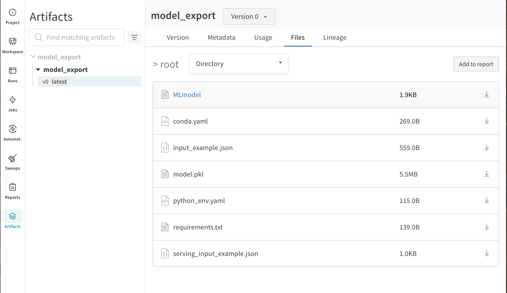

# Instructions
In this exercise you will export a model using the parameters we have found in the previous exercise 
during the experimentation phase.

Within the ``random_forest/run.py`` step complete the ``export_model`` function. Instructions are
provided there.

Once you are done, execute the pipeline setting ``random_forest_pipeline.random_forest.max_depth``
to 13 and ``random_forest_pipeline.tfidf.max_features`` to 10. These parameters are almost the best
performing, and give a small model which is going to be very fast in production. After the run 
your exported pipeline will be saved as the artifact ``exercise_12/model_export``.

```bash
    mlflow run .
```
2026-02-11 07:59:02,585 Downloading and reading test artifact
2026-02-11 07:59:03,377 Extracting target from dataframe
2026-02-11 07:59:03,381 Splitting train/val
2026-02-11 07:59:03,405 Setting up pipeline
2026-02-11 07:59:03,408 Fitting
2026-02-11 07:59:13,527 Scoring
wandb: Adding directory to artifact (/var/folders/4g/4lxxccqx6z3562j1_222qb600000gn/T/tmpnngjk9_o/model_export)... Done. 0.0s
wandb: 🚀 View run magic-firefly-2 at: https://wandb.ai/krseven-j/exercise_12/runs/dd9ppn5k

