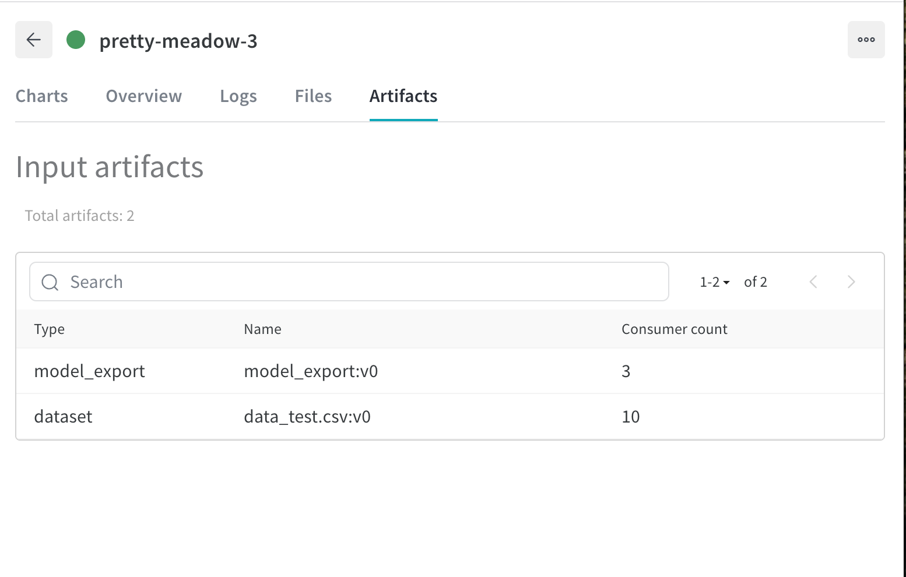

# Instructions
In this exercise you will build a component that fetches a model and test it on the test dataset.

Then, you will mark that model as "production ready".

In order to complete this exercise, go to the ``run.py`` file and complete the code when
requested by comments such as ``## YOUR CODE HERE``. Further instructions are provided there.

Then, run the component using the model exported in ``exercise_12`` 
(``exercise_12/model_export:latest``) and the test data (``exercise_6/data_test.csv:latest``).

Verify that the AUC and the confusion matrix look good, then go to the Artifact section in W&B
and add the tag ``prod`` to the model export artifact (``exercise_12/model_export:latest``) 
to mark is as "production-ready".
> HINT: to apply a new tag, go to the Artifact section of ``exercise_12``, click on 
> ``model_export`` and then select the ``latest`` version. Then go to the Aliases section, click
> on the `+` sign and add the tag ``prod``.
> 


run:
```bash
mlflow run . -P test_data="exercise_6/data_test.csv:latest" -P model_export="exercise_12/model_export:latest"
```

wandb: Tracking run with wandb version 0.21.3
wandb: Run data is saved locally in /Users/j/Desktop/nd0821-c2-build-model-workflow-exercises/lesson-4-training-validation-experiment-tracking/exercises/exercise_13/starter/wandb/run-20260211_081919-9he84eqp
wandb: Run `wandb offline` to turn off syncing.
wandb: Syncing run pretty-meadow-3
wandb: ⭐️ View project at https://wandb.ai/krseven-j/exercise_13
wandb: 🚀 View run at https://wandb.ai/krseven-j/exercise_13/runs/9he84eqp
2026-02-11 08:19:20,067 Downloading and reading test artifact
2026-02-11 08:19:21,214 Extracting target from dataframe
2026-02-11 08:19:21,218 Downloading and reading the exported model
wandb:   7 of 7 files downloaded.  
2026-02-11 08:19:22,810 Scoring
2026-02-11 08:19:22,893 Computing confusion matrix
wandb: 
wandb: 🚀 View run pretty-meadow-3 at: https://wandb.ai/krseven-j/exercise_13/runs/9he84eqp
wandb: Find logs at: wandb/run-20260211_081919-9he84eqp/logs
2026/02/11 08:19:24 INFO mlflow.projects: === Run (ID 'c06adcbb25aa4f3095c5df75abc5b0dc') succeeded ===

